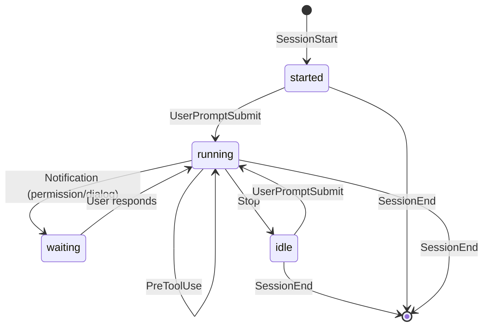

# beacon

[][actions]

[actions]: https://github.com/monochromegane/beacon/actions?workflow=test

beacon is a CLI tool that tracks Claude Code session states within tmux.

When running multiple Claude Code sessions in tmux, it can be difficult to know which sessions need attention. beacon solves this by providing real-time visibility into your Claude Code agents' activity.

**Key Features:**

- **Real-time state tracking** - Converts Claude Code hook events into four intuitive states: `started`, `running`, `waiting`, and `idle`
- **Lightweight design** - No daemon required; uses simple file-based signaling
- **Flexible output** - Supports Go templates for custom formatting
- **tmux integration** - Display session status in your tmux status line
- **macOS menu bar** - SwiftBar/xbar plugin for menu bar display
- **fzf compatible** - Quickly navigate to sessions needing attention

## Usage

beacon provides two main commands:

- `beacon emit` - Emits signals from Claude Code hooks (reads JSON from stdin)
- `beacon scan` - Scans tmux for signals and displays status

### Interactive Session Selector with fzf

Use `beacon scan` with fzf to interactively select Claude Code sessions by their state:

```bash
beacon scan --color=always | fzf --ansi | xargs tmux select-window -t
```

Example output:

```
0: beacon/readme (2 panes) | running: "Update README"
1: myproject/main (1 panes) | idle: "Fix bug", waiting: "Review changes"
2: docs/feature (1 panes)
```

Each line shows the tmux window with Claude Code session states (idle, running, waiting, started).

## Installation

### Homebrew

```bash
brew tap monochromegane/tap
brew install monochromegane/tap/beacon
```

### Go

```bash
go install github.com/monochromegane/beacon@latest
```

## Claude Code Hooks Configuration

Add the following hooks to `~/.config/claude/settings.json`:

```json
{
  "hooks": {
    "SessionStart": [{ "hooks": [{ "type": "command", "command": "beacon clean && beacon emit" }] }],
    "SessionEnd": [{ "hooks": [{ "type": "command", "command": "beacon emit" }] }],
    "UserPromptSubmit": [{ "hooks": [{ "type": "command", "command": "beacon emit" }] }],
    "Stop": [{ "hooks": [{ "type": "command", "command": "beacon emit" }] }],
    "PreToolUse": [{ "hooks": [{ "type": "command", "command": "beacon emit" }] }],
    "Notification": [{ "hooks": [{ "type": "command", "command": "beacon emit" }] }]
  }
}
```

## State Transitions

beacon converts Claude Code hook events into four states for easier monitoring:

| State | Description |
|-------|-------------|
| **started** | Session has begun |
| **running** | Agent is processing (user prompt or tool execution) |
| **waiting** | Agent is waiting for user input (permission or dialog) |
| **idle** | Agent has stopped execution |

### State Diagram



### Event to State Mapping

| Hook Event | State | Notes |
|------------|-------|-------|
| SessionStart | started | Session initialized |
| UserPromptSubmit | running | User input being processed |
| PreToolUse | running | Tool execution in progress |
| Notification (permission_prompt) | waiting | Awaiting permission confirmation |
| Notification (elicitation_dialog) | waiting | Awaiting dialog response |
| Stop | idle | Execution stopped |
| SessionEnd | (removed) | Signal file deleted |

## Non-tmux Usage

`beacon scan` can operate without tmux by using `--env none`:

```bash
# List all signals without tmux
beacon scan --env none

# Use with a Go template
beacon scan --env none --template '{{range .Signals}}{{.State}}: {{.Title}}{{"\n"}}{{end}}'
```

This reads signal files directly without matching them to tmux windows/sessions. The `--env none` mode is used by the SwiftBar/xbar plugin and can be useful in any non-tmux environment.

## macOS Menu Bar (SwiftBar/xbar)

You can display beacon status in the macOS menu bar using [SwiftBar](https://github.com/swiftbar/SwiftBar) or [xbar](https://xbarapp.com/).

Save the following script as `beacon.5s.sh` in your SwiftBar plugins directory:

```bash
#!/bin/bash

export PATH="$HOME/bin:$PATH"
export XDG_CACHE_HOME="$HOME/.cache"

TEMPLATE='{{$i:=false}}{{$r:=false}}{{$w:=false}}{{$s:=false}}{{range .Signals}}{{if eq .State "idle"}}{{$i = true}}{{end}}{{if eq .State "running"}}{{$r = true}}{{end}}{{if eq .State "waiting"}}{{$w = true}}{{end}}{{if eq .State "started"}}{{$s = true}}{{end}}{{end}}{{if $i}}\033[36m●\033[0m{{else}}\033[37m●\033[0m{{end}}{{if $r}}\033[32m●\033[0m{{else}}\033[37m●\033[0m{{end}}{{if $w}}\033[33m●\033[0m{{else}}\033[37m●\033[0m{{end}}{{if $s}}\033[34m●\033[0m{{else}}\033[37m●\033[0m{{end}}'

HEADER=$(beacon scan --env none --template "$TEMPLATE" 2>/dev/null)
if [ -n "$HEADER" ]; then
  echo -e "$HEADER | ansi=true"
else
  echo -e "\033[37m●●●●\033[0m | ansi=true"
fi

echo "---"

beacon scan --env none --color=always 2>/dev/null | while IFS= read -r line; do echo "$line | ansi=true"; done || echo "No active sessions"
echo "---"
echo "Refresh | refresh=true"
```

Output indicators:

```
●●●●
│││└─ started (blue)
││└── waiting (yellow)
│└─── running (green)
└──── idle (cyan)
```

Each indicator lights up in color when that state is active, otherwise displays white. Click the menu bar item to see individual session details.

## Tmux Status Line Example

`beacon scan` supports Go templates via the `--template` option, allowing flexible output formatting.

Create a script (e.g., `beacon-status`) that uses a Go template to display colored status indicators:

```bash
#!/bin/bash
TEMPLATE='{{$i:=false}}{{$r:=false}}{{$w:=false}}{{$s:=false}}{{range .Signals}}{{if eq .State "idle"}}{{$i = true}}{{end}}{{if eq .State "running"}}{{$r = true}}{{end}}{{if eq .State "waiting"}}{{$w = true}}{{end}}{{if eq .State "started"}}{{$s = true}}{{end}}{{end}}{{if $i}}#[fg=cyan]⏺#[default]{{else}}#[fg=white]⏺#[default]{{end}}{{if $r}}#[fg=green]⏺#[default]{{else}}#[fg=white]⏺#[default]{{end}}{{if $w}}#[fg=yellow]⏺#[default]{{else}}#[fg=white]⏺#[default]{{end}}{{if $s}}#[fg=blue]⏺#[default]{{else}}#[fg=white]⏺#[default]{{end}}'
beacon scan --scope session -a --template "$TEMPLATE" 2>/dev/null
```

Output indicators:

```
●●●●
│││└─ started (blue)
││└── waiting (yellow)
│└─── running (green)
└──── idle (cyan)
```

Each indicator lights up in color when that state is active, otherwise displays white.

Add to your `tmux.conf`:

```
set -g status-right '#(beacon-status)'
```

## License

MIT

## Author

[monochromegane](https://github.com/monochromegane)
