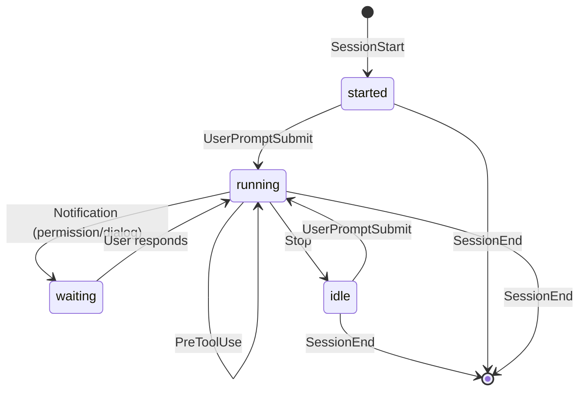

# beacon

[][actions]

[actions]: https://github.com/monochromegane/beacon/actions?workflow=test

beacon is a CLI tool that tracks Claude Code session states within tmux.

## Installation

### Homebrew

```bash
brew tap monochromegane/tap
brew install monochromegane/tap/beacon
```

### Go

```bash
go install github.com/monochromegane/beacon@latest
```

## Usage

beacon provides two main commands:

- `beacon emit` - Emits signals from Claude Code hooks (reads JSON from stdin)
- `beacon scan` - Scans tmux for signals and displays status

### Interactive Session Selector with fzf

Use `beacon scan` with fzf to interactively select Claude Code sessions by their state:

```bash
beacon scan --color=always | fzf --ansi | xargs tmux select-window -t
```

Example output:

```
0: beacon/readme (2 panes) | running: "Update README"
1: myproject/main (1 panes) | idle: "Fix bug", waiting: "Review changes"
2: docs/feature (1 panes)
```

Each line shows the tmux window with Claude Code session states (idle, running, waiting, started).

## State Transitions

beacon converts Claude Code hook events into four states for easier monitoring:

| State | Description |
|-------|-------------|
| **started** | Session has begun |
| **running** | Agent is processing (user prompt or tool execution) |
| **waiting** | Agent is waiting for user input (permission or dialog) |
| **idle** | Agent has stopped execution |

### State Diagram



### Event to State Mapping

| Hook Event | State | Notes |
|------------|-------|-------|
| SessionStart | started | Session initialized |
| UserPromptSubmit | running | User input being processed |
| PreToolUse | running | Tool execution in progress |
| Notification (permission_prompt) | waiting | Awaiting permission confirmation |
| Notification (elicitation_dialog) | waiting | Awaiting dialog response |
| Stop | idle | Execution stopped |
| SessionEnd | (removed) | Signal file deleted |

## Claude Code Hooks Configuration

Add the following hooks to `~/.config/claude/settings.json`:

```json
{
  "hooks": {
    "SessionStart": [{ "hooks": [{ "type": "command", "command": "beacon emit" }] }],
    "SessionEnd": [{ "hooks": [{ "type": "command", "command": "beacon emit" }] }],
    "UserPromptSubmit": [{ "hooks": [{ "type": "command", "command": "beacon emit" }] }],
    "Stop": [{ "hooks": [{ "type": "command", "command": "beacon emit" }] }],
    "PreToolUse": [{ "hooks": [{ "type": "command", "command": "beacon emit" }] }],
    "Notification": [{ "hooks": [{ "type": "command", "command": "beacon emit" }] }]
  }
}
```

## Tmux Status Line Example

Create a script (e.g., `beacon-status`) that uses a Go template to display colored status indicators:

```bash
#!/bin/bash
TEMPLATE='{{$i:=false}}{{$r:=false}}{{$w:=false}}{{$s:=false}}{{range .Sessions}}{{range .Signals}}{{if eq .State "idle"}}{{$i = true}}{{end}}{{if eq .State "running"}}{{$r = true}}{{end}}{{if eq .State "waiting"}}{{$w = true}}{{end}}{{if eq .State "started"}}{{$s = true}}{{end}}{{end}}{{end}}{{if $i}}#[fg=cyan]⏺#[default]{{else}}#[fg=white]⏺#[default]{{end}}{{if $r}}#[fg=green]⏺#[default]{{else}}#[fg=white]⏺#[default]{{end}}{{if $w}}#[fg=yellow]⏺#[default]{{else}}#[fg=white]⏺#[default]{{end}}{{if $s}}#[fg=blue]⏺#[default]{{else}}#[fg=white]⏺#[default]{{end}}'
beacon scan --scope session -a --template "$TEMPLATE" 2>/dev/null
```

States: idle (cyan), running (green), waiting (yellow), started (blue)

Add to your `tmux.conf`:

```
set -g status-right '#(beacon-status)'
```

## License

MIT

## Author

[monochromegane](https://github.com/monochromegane)
